# The Wild Oasis

A modern hotel management dashboard built with React.

This project was created while following [Jonas Schmedtmann’s Ultimate React Course](https://www.udemy.com/course/the-ultimate-react-course/), then customized and deployed as a portfolio-ready app.

## Features

- Secure authentication with Supabase (login, logout, protected routes)
- Dashboard with key business metrics:
  - Total bookings
  - Total sales
  - Check-ins
  - Occupancy rate
- Sales analytics with Recharts (area chart)
- Stay duration distribution chart (pie chart)
- Today activity feed (check-ins / check-outs)
- Cabin management (create, edit, delete)
- Cabin image upload to Supabase Storage
- Booking management:
  - List view with server-side filtering, sorting, and pagination
  - Booking details view
  - Delete booking
- Check-in workflow with optional breakfast add-on calculation
- Check-out action support
- Hotel settings management (breakfast price, min/max nights, max guests)
- User account management (update profile, avatar, password)
- Dark mode support
- Error boundary fallback for runtime errors

## Tech Stack

- React 19
- React Router DOM
- TanStack Query (React Query)
- Supabase (Database, Auth, Storage)
- Styled Components
- React Hook Form
- Recharts
- React Hot Toast
- Vite

## Live Demo

- https://the-wild-oasis-67.netlify.app/

## Screenshots

```md
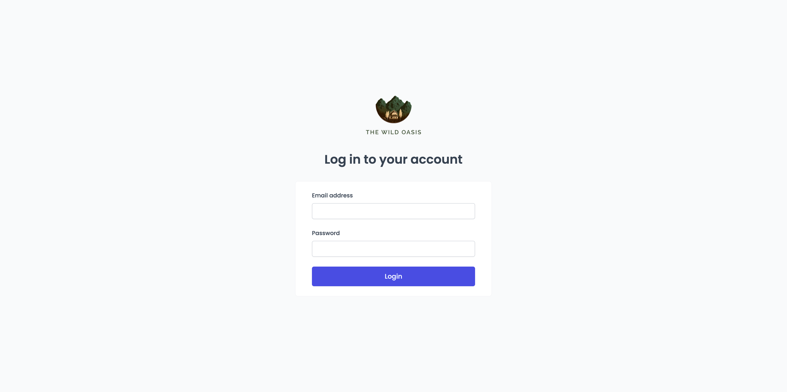
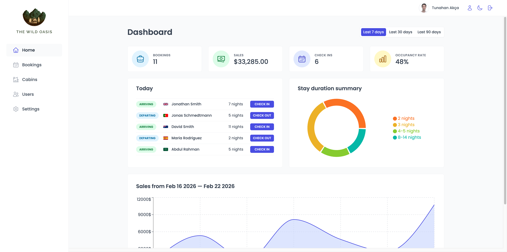
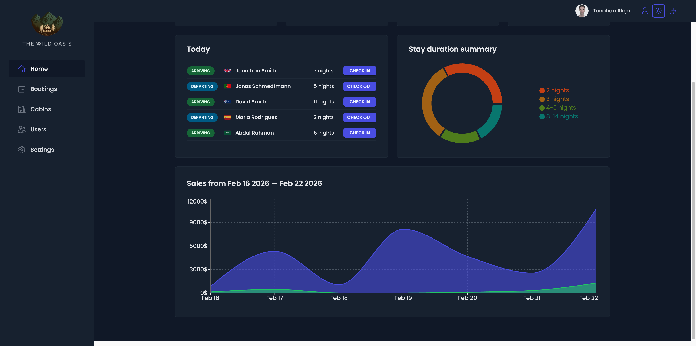
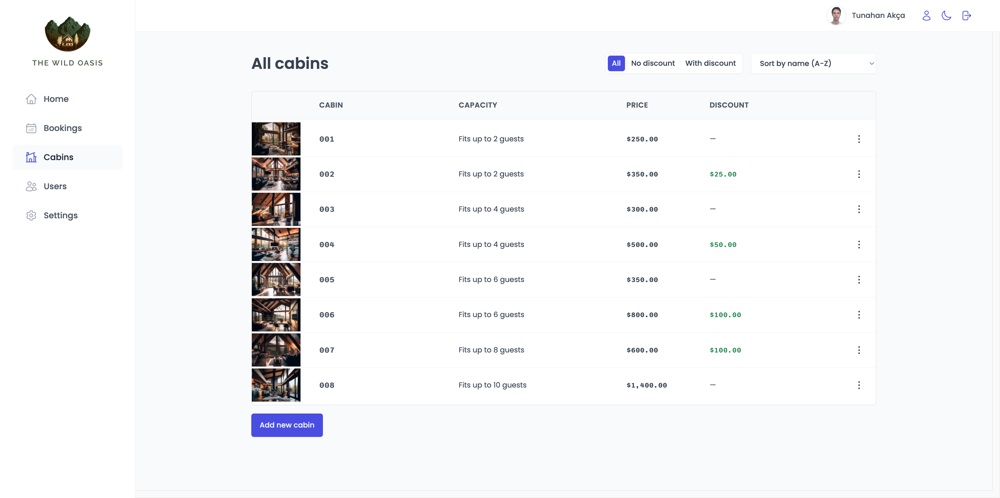
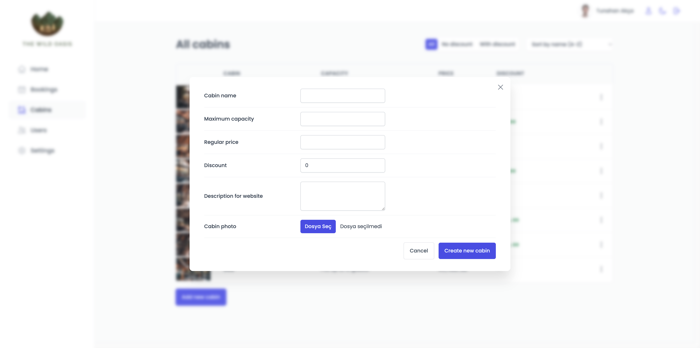
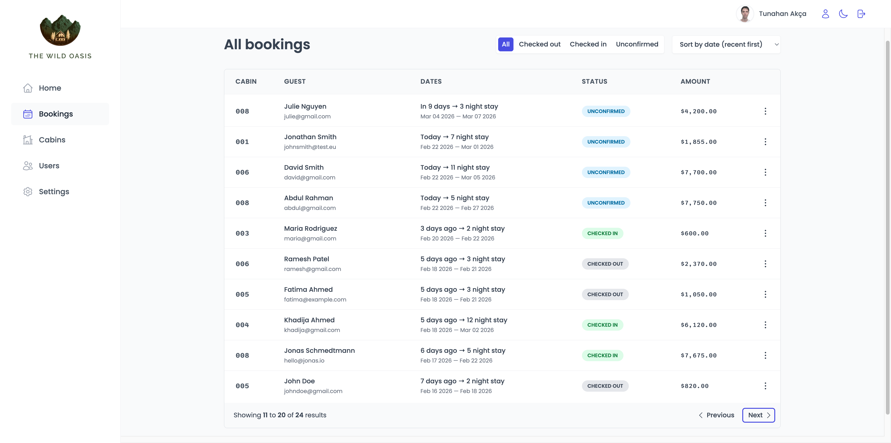
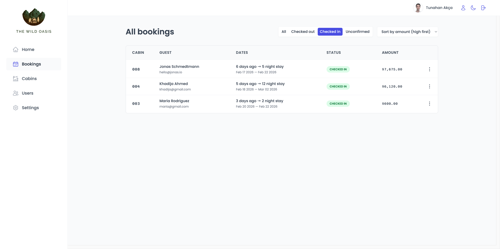
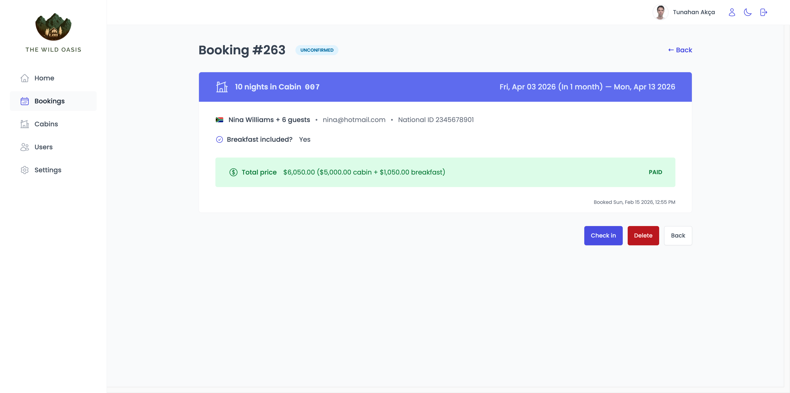
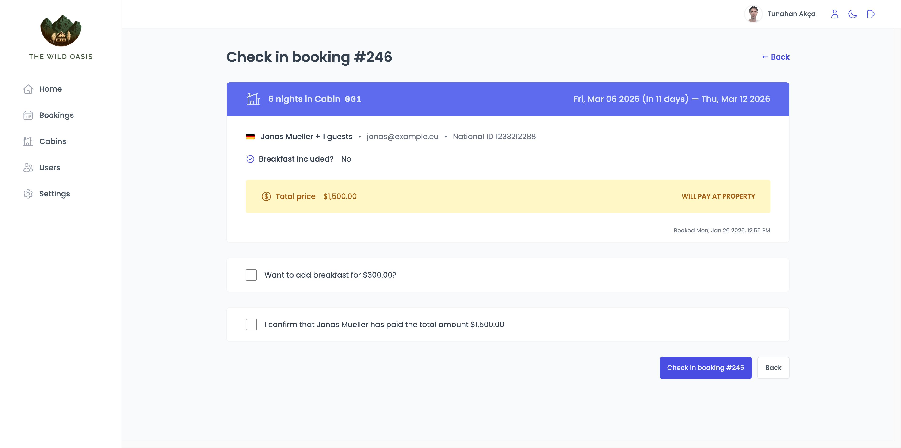
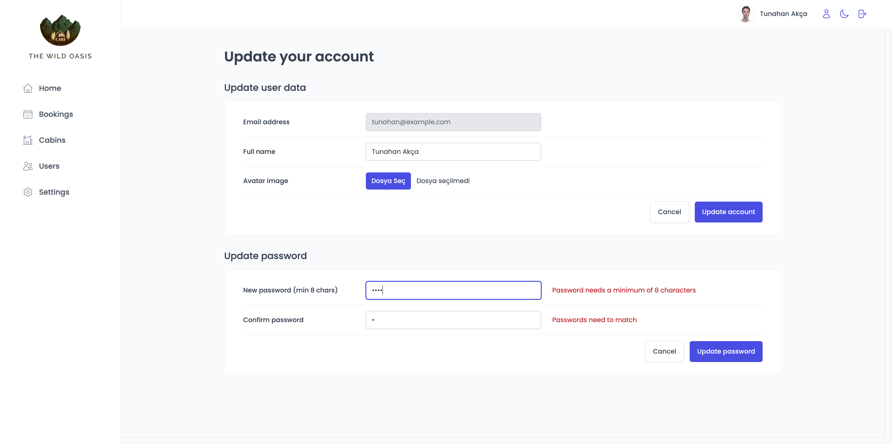
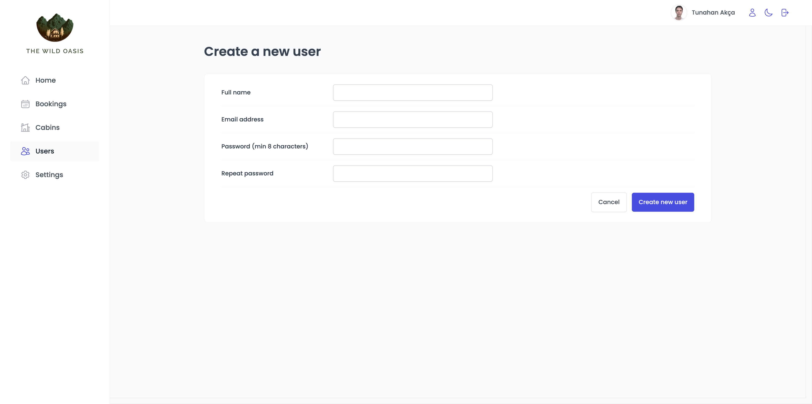
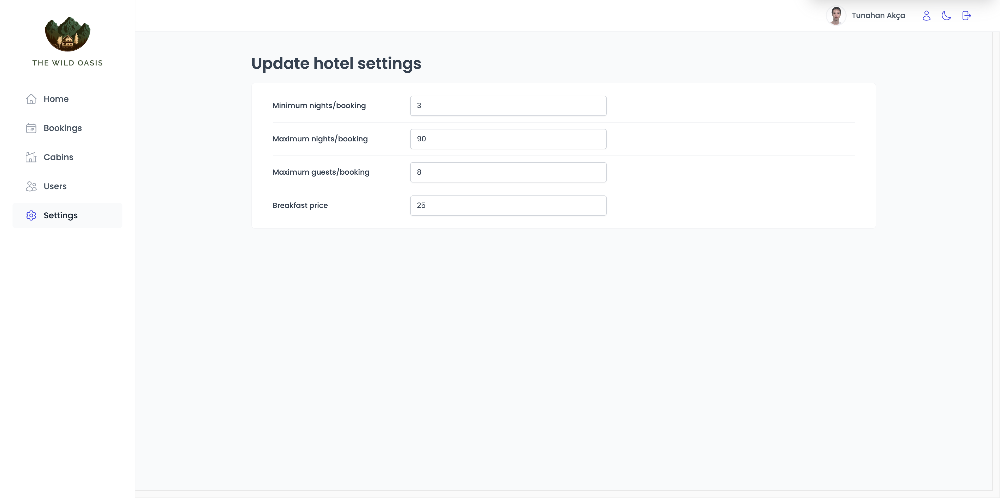
```

## Project Structure

```bash
src/
  features/      # Domain modules: bookings, cabins, dashboard, auth, settings
  services/      # Supabase API integrations
  ui/            # Reusable UI components
  pages/         # Route-level pages
  context/       # Dark mode context
  hooks/         # Custom hooks
  styles/        # Global styled-components setup
```

## Learning Notes

This project helped me practice:

- Building scalable feature-based React architecture
- Managing server state with React Query
- Implementing real-world CRUD flows
- Using Supabase for backend services
- Building reusable component systems with Styled Components

## Acknowledgements

- Course: Jonas Schmedtmann - Ultimate React Course
